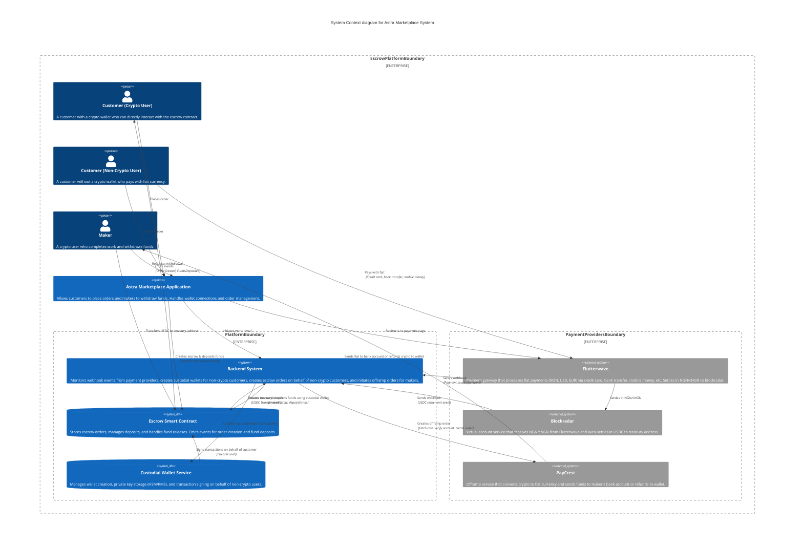
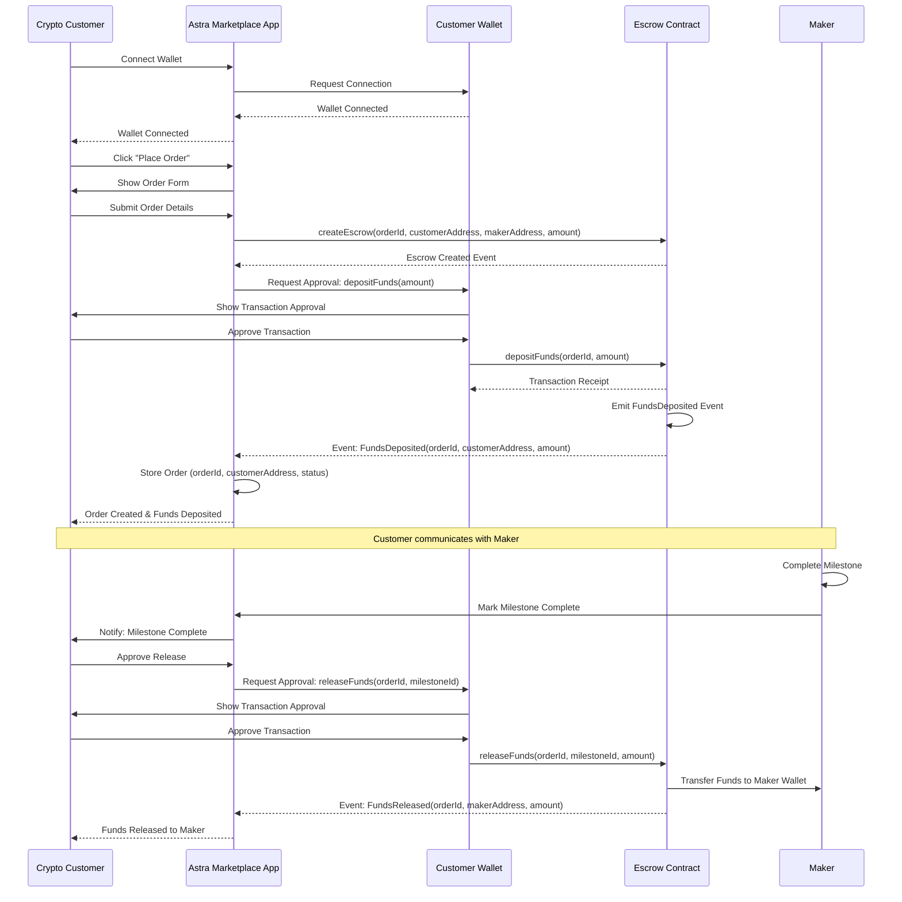
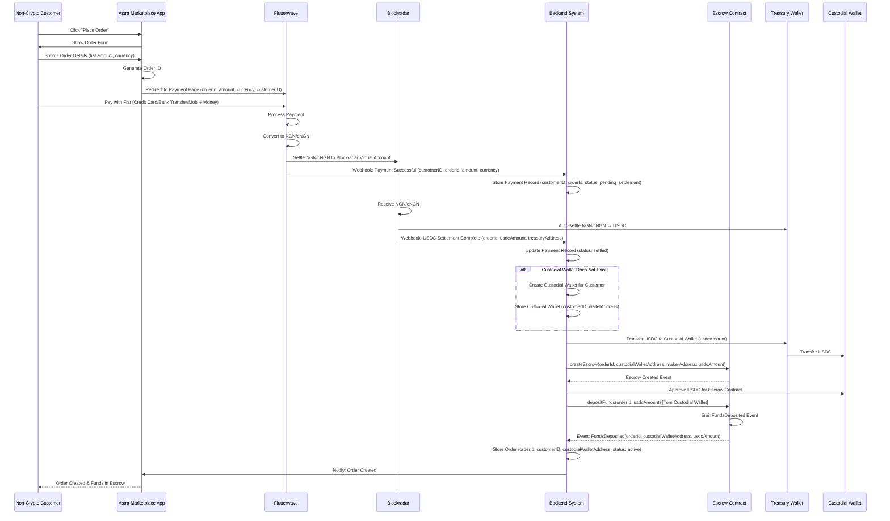
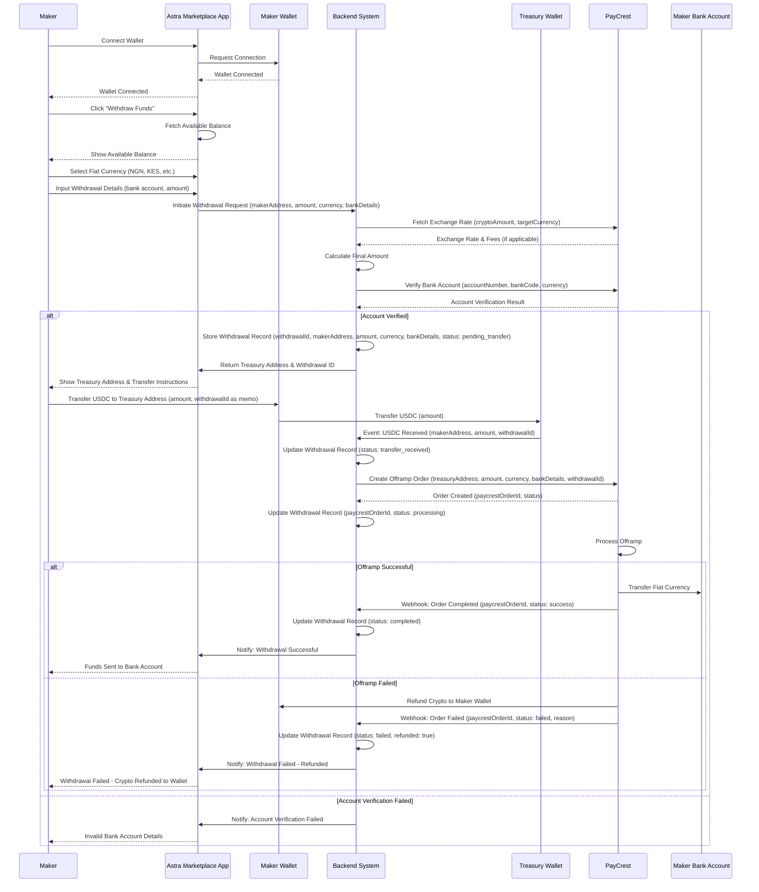
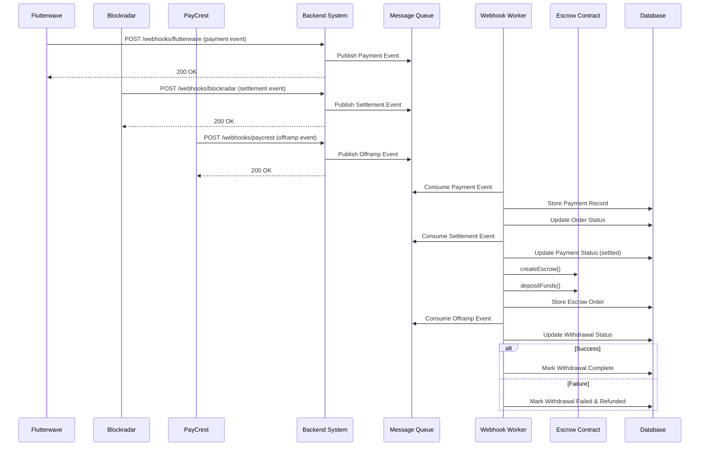

# Astra Marketplace - Architecture Documentation

## Table of Contents
1. [System Overview](#system-overview)
2. [User Stories](#user-stories)
3. [System Context](#system-context)
4. [Flow Diagrams](#flow-diagrams)

---

## System Overview

The Astra Marketplace is a blockchain-based escrow service that enables secure transactions between customers and makers. The platform supports two types of customers:

1. **Crypto Users**: Customers with crypto wallets who can directly interact with smart contracts
2. **Non-Crypto Users**: Customers without wallets who pay with fiat currency, which is automatically converted and deposited into escrow. The platform can create custodial wallets for non-crypto users to manage escrow creation and fund releases on their behalf.

The platform facilitates:
- Order creation and fund escrow
- Milestone-based fund releases
- Fiat-to-crypto conversion for non-crypto users
- Custodial wallet management for non-crypto users
- Crypto-to-fiat offramp for makers

### Key Features
- **Dual Payment Support**: Direct crypto deposits and fiat-to-crypto conversion
- **Smart Contract Escrow**: Decentralized fund management on blockchain
- **Automated Settlement**: Backend automation for non-crypto user payments
- **Custodial Wallets**: Backend-managed wallets for non-crypto users to enable escrow operations
- **Multi-Currency Support**: NGN, USD, EUR (fiat) and USDC, cNGN (stablecoin)
- **Offramp Integration**: Crypto-to-fiat conversion for maker withdrawals via treasury transfer

---

## User Stories

### Customer Stories

#### US-1: Crypto Customer Places Order
**As a** crypto user with a wallet  
**I want to** place an order and deposit funds directly to escrow  
**So that** I can securely transact with makers using my crypto assets

**Acceptance Criteria:**
- Customer can connect their wallet to the application
- Customer can create an escrow order via smart contract
- Customer can deposit funds directly to the escrow contract
- Order creation and deposit events are emitted and stored

#### US-2: Non-Crypto Customer Places Order
**As a** customer without a crypto wallet  
**I want to** pay with fiat currency (credit card, bank transfer, mobile money)  
**So that** I can use the escrow service without needing crypto knowledge

**Acceptance Criteria:**
- Customer can place an order without wallet connection
- Customer is redirected to Flutterwave payment page
- Payment can be made in NGN, USD, or EUR
- Backend automatically converts fiat to crypto
- Backend creates a custodial wallet for the customer (if not already exists)
- Backend creates escrow using the custodial wallet address
- Customer receives confirmation of order creation

#### US-3: Customer Releases Funds
**As a** customer  
**I want to** release funds to the maker when milestones are completed  
**So that** I can pay for completed work

**Acceptance Criteria:**
- Customer can view order status and milestones
- Customer can approve fund release for completed milestones
- For crypto users: Funds are released directly from escrow to maker's wallet via customer's wallet
- For non-crypto users: Backend releases funds from escrow using the custodial wallet on customer's behalf
- Transaction is recorded on blockchain

### Maker Stories

#### US-4: Maker Withdraws Funds
**As a** maker with a crypto wallet  
**I want to** withdraw my earnings to my bank account in fiat currency  
**So that** I can receive payment in my local currency

**Acceptance Criteria:**
- Maker can connect wallet and view available balance
- Maker can select withdrawal currency (NGN, KES, etc.)
- Maker can input bank account details
- Maker transfers USDC from their wallet to backend's treasury address
- Backend detects treasury transfer and initiates offramp order with PayCrest
- Maker receives fiat currency in bank account or crypto refund if failed

#### US-5: Maker Views Orders
**As a** maker  
**I want to** view my active orders and milestones  
**So that** I can track my work progress and payments

**Acceptance Criteria:**
- Maker can see all assigned orders
- Maker can view milestone status
- Maker can see available balance for withdrawal

---

## System Context

---

## Flow Diagrams

### Customer Journey: Crypto User

### Customer Journey: Non-Crypto User

### Maker Journey: Withdraw Funds

### Backend Webhook Processing Flow

